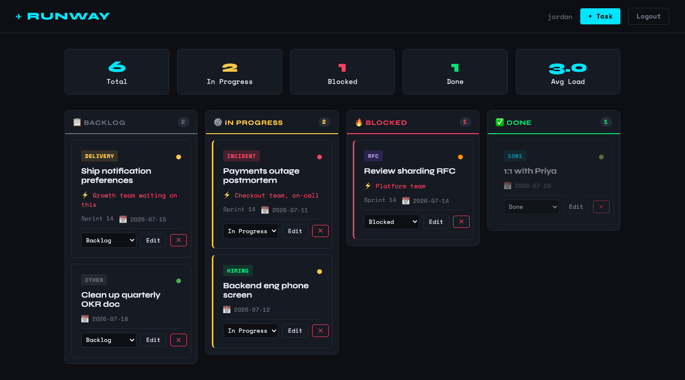

# Runway


A personal cognition aid for Engineering Managers — not another task tracker. An EM juggles incidents, RFCs, 1:1s, hiring, and delivery work in the same afternoon, plus the promises they've made, the people they're waiting on, and the work they've handed off. Runway's job is to answer, at a glance: **what should I do right now, what am I waiting on, what am I neglecting, and where am I a bottleneck** — deriving that from state, time, and relationships instead of just listing tasks.



*(screenshot predates the assembled dashboard below — see "What it does")*

## Quickstart

```bash
python3 -m venv venv && source venv/bin/activate && pip install -r requirements.txt
sqlite3 runway.db < schema.sql
python3 migrate_slice_d.py   # adds the settings table (available hours, meeting hours)
```

Copy `.env.example` to `.env` and set `SECRET_KEY` — the app won't start without it.

```bash
cp .env.example .env
python3 -c "import secrets; print(secrets.token_hex(32))"  # paste the output into .env
```

```bash
flask --app app:app run --debug
```

`ANTHROPIC_API_KEY` is optional — it enables AI-powered quick-add (freeform text → classified item) and the weekly AI recap. The app runs fully without it; those features fall back to manual entry / the raw numbers. See `.env.example` for details.

## Tests

```bash
pip install -r requirements-dev.txt
pytest tests/ -v
```

152 tests covering auth, CSRF, rate limiting, the global error handler, item capture/classification, the recommendation engine, relationship surfaces (commitments/waiting/delegated/people), weekly review + capacity, the assembled dashboard, and the schema migrations. CI runs the suite on every push/PR to `main`.

## What it does

Runway is built around one item model — `stream` (`task` / `commitment` / `delegation` / `waiting`) plus an optional `person` — seen from four angles:

| Surface | Route | Answers |
|---|---|---|
| **Capture** | `/add`, `/quick-add` | Turn a line of freeform text into a classified item — type, priority, effort, person, and stream — via an optional Claude-powered extraction step, or fill it in by hand. |
| **Now** | `/now` | A ranked, time-box-aware list of what to work on next, with a plain-English reason on each ("10m · blocking 3 people"). Excludes anything that doesn't fit the time you have, with a smallest-first fallback if nothing does. |
| **Relationships** | `/commitments`, `/waiting`, `/delegated`, `/people` | Promises you've made, what you're waiting on, what you've delegated — grouped by person, aged, with a follow-up action on stale or overdue items. |
| **Review** | `/review` | The Friday ritual: completed/carried-forward/delegated/waiting counts, a time breakdown by type and by reactive-vs-proactive mode, a capacity read against your available hours, delegation suggestions, and a carry-forward reset. |
| **Dashboard** | `/` | All of the above, composed onto the landing page — a Now teaser, a Waiting-on teaser, a neglected-high-priority-items widget, a bottleneck widget, and a capacity snapshot — above the underlying kanban board of every task. |

## Data model

- `tasks` — the core item table. `stream` and the EM taxonomy (`item_type`, `priority`, `effort_minutes`, `mode`) sit alongside the original fields (`task_type`, `blast_radius`, `sprint`, `cognitive_load`) kept for continuity; `person_id`, `is_blocking`, and `last_touched_at` drive the relationship and staleness signals.
- `people` — a lightweight directory (name/role/notes), the join point for commitments, delegation, and waiting-on.
- `events` — append-only history (`created`, `touched`, `status_changed`, `completed`, `delegated`, `followed_up`, ...). Weekly-review counts and staleness are always derived from this log, never from mutating a row in place.
- `settings` — per-user key/value store (`available_hours`, `meeting_hours_this_week`) for the capacity read.

Full column-level detail and the enum lists (`VALID_STREAMS`, `VALID_ITEM_TYPES`, etc.) live in `AGENTS.md`.

## Engineering notes

- **Module split**: `app.py` holds routing, validation, auth, and a few small pure helpers used directly by its own routes (e.g. relationship aging/escalation). `db.py` holds every query (one function per read/write, plus the append-only `log_event`). `classify.py` wraps the Claude extraction calls. `recommend.py` and `capacity.py` are pure functions — no DB, no Flask, no network — so the ranking and aggregation logic is unit-tested directly against plain data, not through the app.
- **Migrations**: `schema.sql` bootstraps a fresh install; `migrate_slice0.py` and `migrate_slice_d.py` apply the same additive changes to an existing `runway.db`, idempotently.
- **Validation**: server-side validation mirrors the `CHECK` constraints in `schema.sql` — bad input gets a flash message, not a stack trace.
- **Error handling**: a global exception handler logs the full traceback server-side and returns a generic response to the client either way, whether or not `--debug` was left on by accident.
- **Rate limiting**: `/login` and `/register` are rate-limited per-IP to slow brute-force attempts.
- **Logging**: structured, leveled logs for auth events (login/logout/register, failed attempts) — never raw passwords.
- **Runs reliably in the background**: a Gunicorn + launchd setup (`deploy/`) that self-heals if the process crashes, without auto-starting on login/reboot. See `AGENTS.md` for the exact commands.

Deeper technical notes and the full build history live in `AGENTS.md`, `docs/product-brief.md`, and `docs/technical-design.md`.

## Project layout

| Path | Purpose |
|---|---|
| `app.py` | Routes, auth, validation, error handling, rate limiting, logging |
| `db.py` | Every database query and write, plus the append-only event log |
| `classify.py` | AI extraction — freeform text into a classified item |
| `recommend.py` | The pure "what should I do now" ranking engine |
| `capacity.py` | Pure weekly-review and dashboard aggregations |
| `events.py` | Read-only event-history helpers |
| `schema.sql`, `migrate_slice0.py`, `migrate_slice_d.py` | Fresh-install schema and additive migrations for an existing DB |
| `templates/` | Jinja2 templates for every surface above |
| `static/` | Dark-themed CSS and a small `fetch()`-based status-update script |
| `tests/` | pytest suite (mirrors the module split) |
| `deploy/` | launchd config for running in the background |

## Design choices

**One item table with a `stream` discriminator, not four separate lists.** "Waiting on", "delegated", and "commitment" are the same relationship seen from different angles — modeling direction plus time, rather than four parallel tables, is what lets the Now/Waiting/Delegated/Review surfaces all read from one place.

**The recommendation and capacity engines are pure functions.** No DB access, no LLM call — inputs are plain data, output is a ranked list or a computed aggregate. That's what makes the "25 minutes before a meeting shouldn't suggest a 2-hour doc" behavior, and the weekly capacity math, densely unit-testable without spinning up the app.

**Blast radius + cognitive load instead of a single priority flag** (kept from the original design, alongside the newer `priority`/`effort_minutes` fields). Blast radius names who or what is blocked if a task slips; cognitive load (1–5) separates *time-consuming* from *mentally demanding* — a light calendar day can still be a heavy one.

**SQLite + vanilla JS over Postgres + a frontend framework.** This is a single-user local tool, not a service with concurrent writers. `cs50.SQL` keeps queries readable, and a handful of `fetch()` calls are all the interactivity the UI needs — reaching for a framework here would be solving a problem this app doesn't have.
